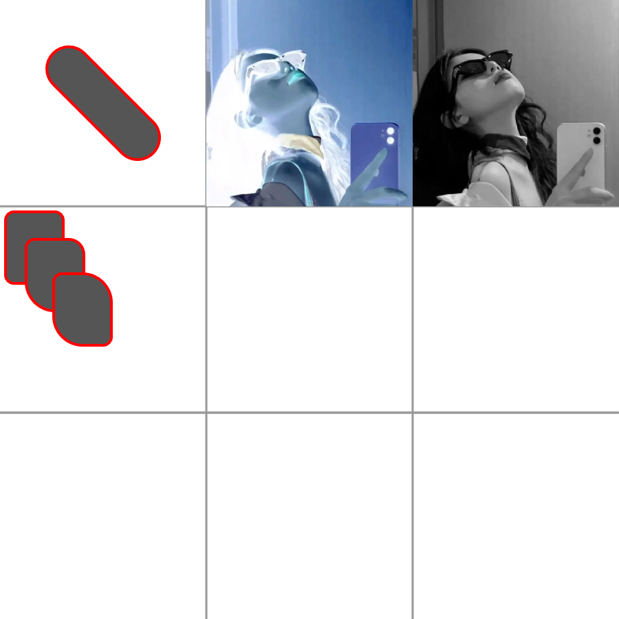

# Canvas +


This a extension methods package to canvas.

## Platform

- [x] ie11+

## Example

HTML 5

```html
<!DOCTYPE html>
<html lang="en">

<head>
    <meta charset="UTF-8">
    <meta name="viewport" content="width=device-width, initial-scale=1.0">
    <style>
        #drawCapsule {
            width: 100vmin;
            height: 100vmin;
            background-color: #000;
            display: flex;
        }
    </style>
</head>

<body>

    <canvas id="drawCapsule"></canvas>
    <script type="module">
        import "https://cdn.jsdelivr.net/npm/@3r/canvas-plus@0.0.9/index.js"
        /** @type {HTMLCanvasElement} */
        let canvas = document.querySelector("#drawCapsule")
        let ctx = canvas.getContext('2d')
        let width = canvas.clientWidth;
        let height = canvas.clientHeight;
        canvas.width = width;
        canvas.height = height;

        ctx.strokeStyle = '#f00'
        ctx.lineWidth = 8;

        ctx.clearRect(0, 0, width, height)
        
        ctx.drawCapsule(100, 100, 500, 500, 50)  
    </script>
</body>

</html>
```

Preview


